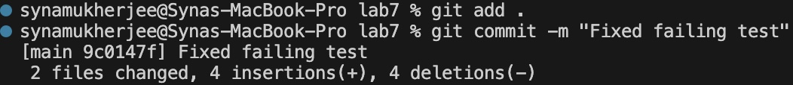

# Lab Report 4 - Vim (Week 7)

## Task Execution

### Step 1: Clone Repository

**Screenshot:** 

**Keys Pressed:** 
- `git clone https://github.com/syna230404/lab7`

**Summary of Command:** Cloned the repository from my GitHub account using the SSH URL.

### Step 2: Run Tests (Demonstrating Failure)

**Screenshot:** 

**Keys Pressed:** 
- `javac ListExamples.java <enter> javac -cp .:lib/hamcrest-core-1.3.jar:lib/junit-4.13.2.jar *.java <enter> java -cp ../libs/junit-4.13.2.jar:../libs/hamcrest-2.2.jar:. org.junit.runner.JUnitCore ListExamplesTests <enter>`

**Summary of Command:** Executed the test script to demonstrate initial test failures.

### Step 3: Edit Code to Fix Failing Test

**Screenshot:** 

**Keys Pressed:** 
- `vim ListExamples.java`
- `44j e x i2 <esc> :wq!`

**Summary of Command:** Opened the file in Vim to edit and fix the failing test.

### Step 4: Run Tests Again (Demonstrating Success)

**Screenshot:** 

**Keys Pressed:** 
- `bash test.sh <enter>`

**Summary of Command:** Re-executed the test script to demonstrate successful test runs after code fix.

### Step 5: Commit and Push Changes

**Screenshot:** 

**Keys Pressed:** 
- `git add .`
- `git commit -m "Fixed failing test"`
- `git push origin master`

**Summary of Commands:** Staged changes, committed with a descriptive message, and pushed to GitHub.

## Conclusion

In this lab report, I successfully completed the tasks outlined for Week 7. Each step was documented with screenshots and descriptions of the keys pressed. The code was edited to fix failing tests, and changes were committed and pushed to GitHub. This exercise provided hands-on experience with using Vim, Git, and command line tools for software development tasks.
